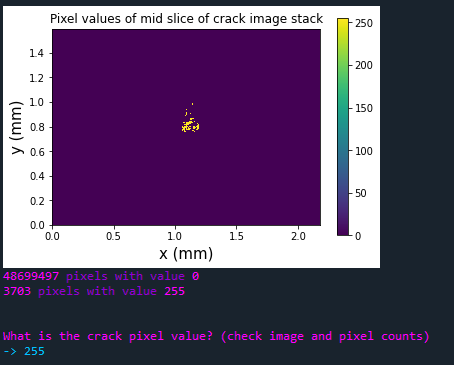
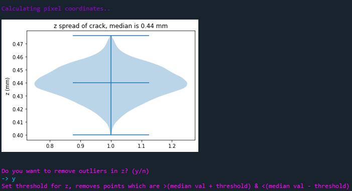
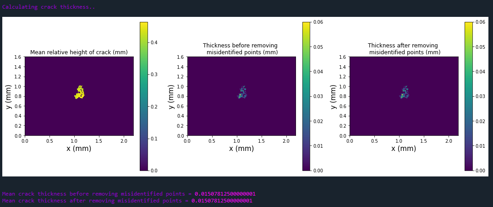

## Description

This is an interactive command line Python code to analyze and quantify segmented crack images from X-ray computed tomography data.

In principle this code can also be used on any other segmented image where the user would like to see a color map of the feature thickness or height.

## Setup
Clone the repository (or download it's contents manually):
```shell
git clone https://github.com/Bhejazi/crack-thickness.git
```

Install the required packages:
```shell
python -m pip install -r requirements.txt
```

## Usage
- Run the program with your editor of choice. The program is used via a command line interface.

- The program will now prompt you to `Enter image file path:`
##
### Note on input image file format
The program accepts segmented `.tif` images of the crack or feature being analyzed.
##

- Once file path is entered the program will ask `What is the voxel size? (in \micro m)`.

  Enter the known experimental voxel size so that calculations and output are in appropriate dimensions.

- After images are loaded you will need to specify the segmented crack pixel value.

  You can use the sample slice image and count of pixel values in the entire image stack to check the crack pixel value.



- After entering the crack pixel value, pixel coordinates are calculated and the height (z) spread of pixels is displayed.

  You can decide if any pixels should be considered outliers or not and whether they need to be deleted.

  `Do you want to remove outliers in z? (y/n)`

  If you would like to remove outliers then specify the z threshold.



- Next you will be prompted to determine the bin size for how the data will be binned and displayed: Here each bin is a square with the size given by the binsize value.

  `Set binsize for crack thickness calculation (start with 0.01 and adjust for higher or lower resolution)`.

-> The thickness across the cross-section of the crack is calculated by taking the difference between the maximum and minimum values of the point cloud in a given bin.

-> The mean crack thickness is also reported. Here the mean thickness is the mean of all the local binned thicknesses across the crack.

After calculation is complete the crack thickness and relative crack height are displayed on a colormap.



- In the end you will be asked if you would like to save the output figure and to enter the save path. The output figure is saved as a `.pdf` file.

  You can also decide to try another binsize and optimize the output or complete the analysis.
